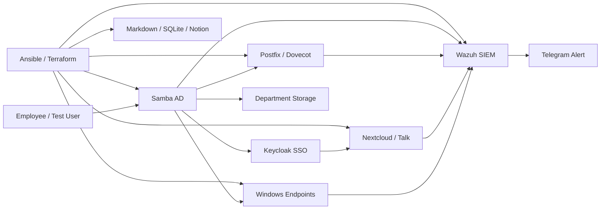

# IT Operations Automation Portfolio

기업 IT Manager 업무를 개인 homelab에서 구현하고 검증한 포트폴리오다. 계정과
권한, Windows endpoint, 협업 서비스, 사용자 지원, 보안 가시성, 운영 증적을
서로 분리된 설치 목록이 아니라 하나의 운영 workflow로 연결하는 데 초점을
맞췄다.

이 저장소는 실제 회사의 운영 환경이나 재직 경험을 재현했다고 주장하지 않는다.
모든 결과는 개인 소유의 격리된 Proxmox lab과 test identity/endpoint에서 수행한
설계, 구현, 장애 대응 및 검증 기록이다.

## 핵심 구현

| IT Manager 업무 | 구현 및 검증 결과 |
|---|---|
| 계정·권한 | Samba AD 계정/그룹, Keycloak LDAP federation, OIDC group claim, 부서별 storage 권한 |
| 입사자 온보딩 | AD 사용자·메일 속성·부서 그룹 생성, 핵심 서비스 검증, Markdown/SQLite 증적 |
| Windows endpoint | Offline Domain Join, 자산 등록, Wazuh agent, pilot 범위 표준 앱 배포 |
| 권한 분리 | 일반 사용자에게 관리자 암호를 주지 않고 SYSTEM context로 승인 앱 설치 |
| 사용자 지원 | 6개 helpdesk scenario, read-only 진단, 영향·원인·후속 조치 리포트 |
| 협업 환경 | Nextcloud, Talk, Mail, 부서별 파일 공유, 사용자용 IT 가이드 |
| 보안 가시성 | Wazuh 8개 managed agent, Windows EventChannel, custom detection, Telegram 알림 |
| 운영 품질 | Ansible idempotency, Terraform plan, backup/restore test, health report, GitOps |

## 대표 문제 해결 사례

### 1. 계정 생성이 아니라 업무 시작까지 검증하는 온보딩

AD 사용자 생성에서 끝내지 않고 부서 그룹, mail attribute, Keycloak federation,
Nextcloud 권한, Mail, Wazuh baseline까지 확인한다. 비밀번호는 명령행 인자로
받지 않으며 실행 결과는 Markdown과 SQLite에 `success`, `partial`, `failed`로
기록한다.

- [입사자 온보딩 runbook](docs/operations/employee-onboarding-runbook.md)
- [비전문가용 IT 시작 가이드](docs/getting-started/employee-it-onboarding.md)

### 2. 관리자 권한을 주지 않는 Windows 앱 배포

사용자용 share와 컴퓨터 계정용 installer share를 분리하고, pilot 보안 그룹에
포함된 endpoint만 SYSTEM scheduled task로 승인 앱을 설치하도록 구성했다.
`ODJ-VERIFY01`에서 실제 설치, detection, 즉시 실행, 재부팅 후 ONSTART 실행을
검증했다.

- [Endpoint 표준 앱 배포 사례](docs/portfolio/endpoint-app-deployment-system-install.md)
- [Endpoint 운영 runbook](docs/services/endpoint-management.md)

### 3. 로그 수집 장애를 성공으로 오판하지 않게 만든 Wazuh 개선

Windows shared config backup 파일명이 agent sync를 깨뜨린 문제와 manager
재시작 후 `wazuh-remoted`가 종료된 문제를 진단·복구했다. 이후 배포 성공 조건에
TCP 1514 listen과 전체 8개 managed agent의 Active 복귀를 추가했다.

- [Wazuh custom detection runbook](docs/services/wazuh-custom-detections.md)
- [Kali/Wazuh 검증 handoff](docs/archive/session-handoffs/session-handoff-2026-07-28-kali-egress-enabled.md)

## 아키텍처



상세 구성은 [아키텍처 문서](docs/architecture.md)에서 확인할 수 있다.

## 10분 검토 경로

인프라에 접속하지 않고 저장소의 지원 증거와 안전장치를 확인한다.

```bash
./scripts/portfolio-check.sh
```

그다음 아래 문서를 순서대로 읽는다.

1. [토스 IT Manager 지원 증거 매트릭스](docs/portfolio/toss-it-manager-application.md)
2. [이력서 프로젝트 문안](docs/portfolio/resume-project-draft.md)
3. [10분 데모 runbook](docs/portfolio/it-manager-demo-runbook.md)
4. [전체 프로젝트 보고서](docs/portfolio/sme-security-infra-report.md)

운영자가 live lab 상태를 확인할 때는 별도 secret이 준비된 automation node에서
`./scripts/verify-and-report.sh`를 사용한다.

## 검증 원칙

- 실제 변경 전에 syntax, plan, fixture 또는 pilot 검증을 수행한다.
- 반복 실행 시 불필요한 변경이 없는지 `changed=0`으로 확인한다.
- 서비스 프로세스뿐 아니라 사용자 흐름과 endpoint 결과를 함께 확인한다.
- password, token, webhook, Vault 평문, tfstate는 Git에 저장하지 않는다.
- 계정 삭제, firewall 변경, malware test 같은 작업은 별도 승인 없이 실행하지 않는다.

## 정직한 범위

**검증 완료**

- Windows 11 test endpoint 2대와 Linux server agent를 포함한 Wazuh 8-agent 운영
- Windows ODJ, endpoint 자산 등록, pilot 앱 배포와 reboot 검증
- AD/SSO/Mail/Nextcloud 연동 및 입사자 workflow
- helpdesk 진단 리포트, health report, backup/restore 검증

**아직 실무 경험으로 주장하지 않는 범위**

- 실제 임직원 또는 production tenant 운영
- macOS/MDM 실기 운영
- Google Workspace production administration
- 물리 복합기, NAC, DLP의 실제 사무실 운영
- 대규모 endpoint fleet와 실제 사용자 SLA/MTTR

이 공백과 후속 계획도
[지원 증거 매트릭스](docs/portfolio/toss-it-manager-application.md)에 공개한다.

## 저장소 안내

- [문서 시작점](docs/README.md)
- [운영 모드](docs/operations/operation-modes.md)
- [전체 verification](docs/operations/verification-runbook.md)
- [Helpdesk scenario](docs/operations/helpdesk-scenarios.md)
- [복구 문서](docs/recovery)
